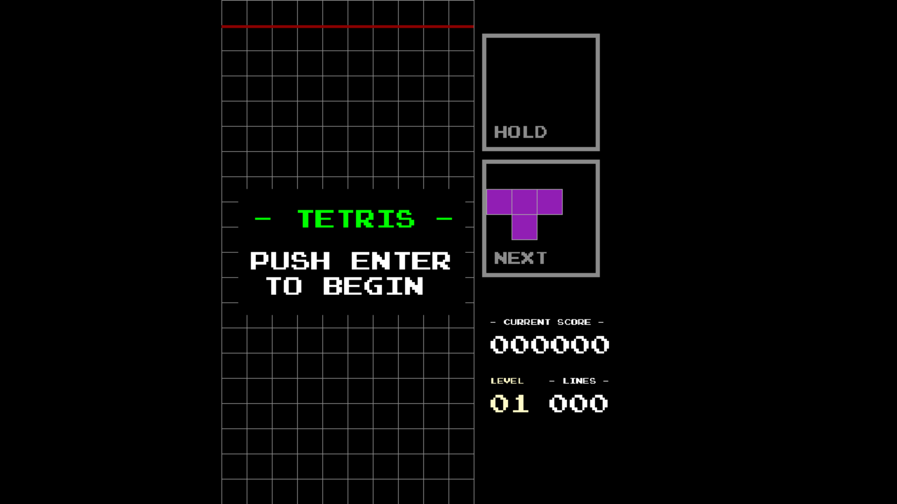

# Tetris Game - .NET 9.0 & vbPixelGameEngine



## Description
This project is a classic Tetris game implemented in .NET 9.0 using @DualBrain's `vbPixelGameEngine`, with the Super Rotation System (SRS) as an authentic gameplay mechanic. The game features a modern scoring system with line clears, T-spins, soft-drops and hard-drops.

NOTE: Background music used in this game is sourced from the SEGA System-B version (the arcade platform) of Tetris, and the Game Over sound effect is sourced from the GameBoy version of the same game.

## Controls
| Key | Action |
| --- | --- |
| Left Arrow | Move left |
| Right Arrow | Move right |
| Up Arrow | Rotate clockwise |
| Down Arrow | Soft-drop piece |
| Space | Hard-drop piece |
| C | Hold piece |
| Z | Rotate counter-clockwise |
| X | Rotate clockwise (same as up arrow) |
| P | Pause game |
| R | Restart game |
| ESC | Exit game |

## Scoring System
The game features a comprehensive scoring system with modern Tetris mechanics:

### Line Clear Scoring
| Lines Cleared | Base Score |
| --- | --- |
| 1 Line | 100 × Level |
| 2 Lines | 300 × Level |
| 3 Lines | 500 × Level |
| 4 Lines (Tetris) | 800 × Level |

### T-Spin Scoring
- **Standard T-Spin**: 150 points (plus 150 × lines cleared if lines are cleared)
- **Mini T-Spin**: 100 points (plus 100 × lines cleared if lines are cleared)

### Additional Scoring
- **Soft-drop**: 1 point per cell (when holding DOWN key)
- **Hard-drop**: 2 points per cell dropped

### Level Progression
- Level increases every 10 lines cleared
- Fall speed increases with each level (base speed: 0.5s per cell, minimum: 0.1s)
- Score multipliers increase with level

## Prerequisites
- [.NET SDK 9.0+](https://dotnet.microsoft.com/download/dotnet/9.0)
- [vbPixelGameEngine.dll](https://github.com/DualBrain/vbPixelGameEngine)
- IDE: [Visual Studio](https://visualstudio.microsoft.com/) or [Visual Studio Code](https://code.visualstudio.com/)

## Getting Started
1. Clone the repository and navigate to the project directory:
```bash
git clone https://github.com/Pac-Dessert1436/VBPGE-Tetris-Game.git
cd VBPGE-Tetris-Game
```
2. Restore dependencies, then build and run the project:
```bash
dotnet restore
dotnet build
dotnet run
```
3. Enjoy the game!

## License
This project is licensed under the MIT License. See the [LICENSE](LICENSE) file for details.